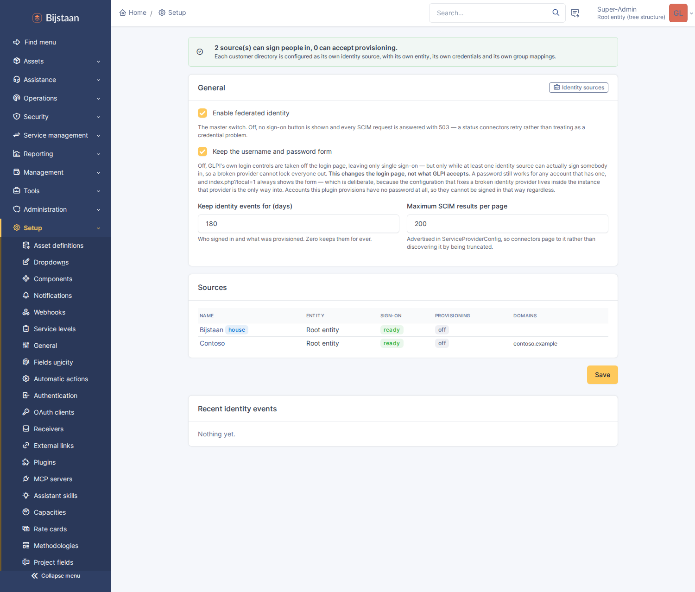
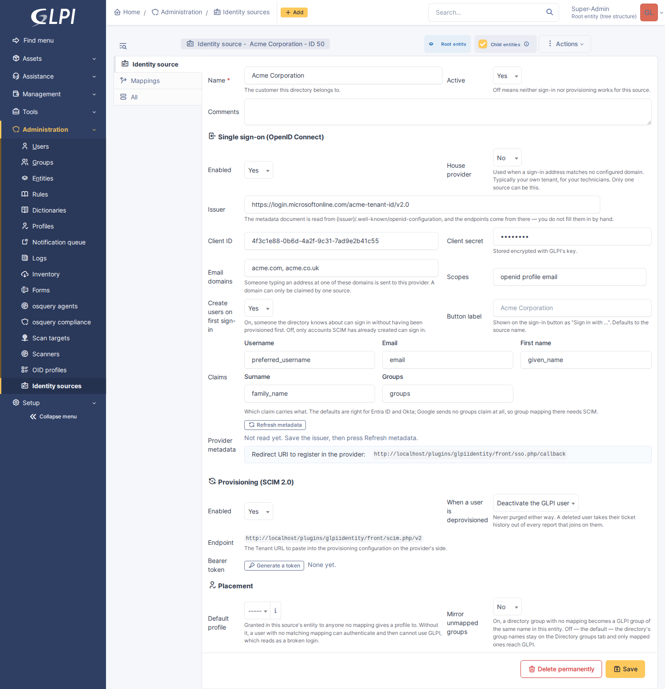
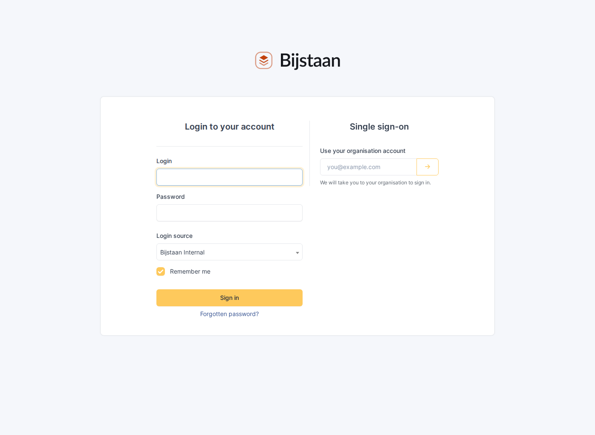
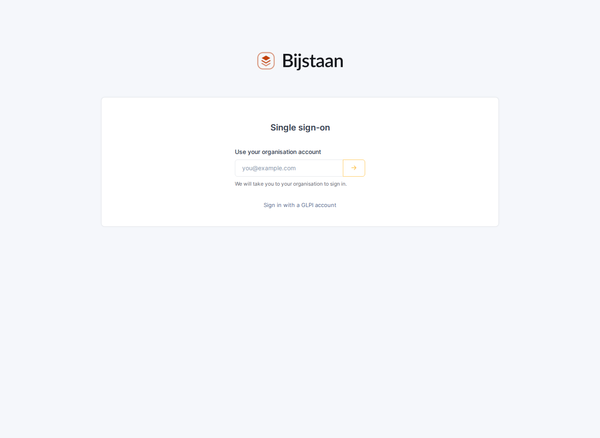

# GLPI Identity

OpenID Connect sign-in and SCIM 2.0 provisioning for GLPI, with each customer
bringing their own identity provider.

An MSP's GLPI holds several organisations' people. This plugin lets each of them
sign in with their own IdP, be provisioned into their own entity by their own
SCIM connector, and land in the GLPI groups and profiles that a mapping says
their directory's groups mean.

Requires GLPI 11.0 or later. No new dependencies: GLPI already ships
`league/oauth2-client`, `firebase/php-jwt` and `ramsey/uuid`.

---

## What it does

- **Sign-in** — OpenID Connect authorisation-code flow with PKCE, against as
  many providers as you have customers. The login page takes an email address
  and routes on its domain; a "house" provider covers your own technicians.
- **Provisioning** — a SCIM 2.0 endpoint per source, with its own bearer token,
  writing only into that source's entity.
- **Mapping** — rules that turn what a directory says into what GLPI does:
  *"groups contains Executive → add to the VIP group"*, *"groups is IT Staff →
  grant the Technician profile"*, *"department is Field Services → set their
  location to the depot"*.
- **An audit trail** of who signed in, what was provisioned, and what was
  refused.

OIDC only — no SAML. Every provider an MSP meets speaks OIDC, and SAML would
mean vendoring an XML-signature library into a GLPI install. XML signature
verification is the one place where a subtle mistake is a silent authentication
bypass rather than an error.

---

## The safety model

This is the part worth reading before the setup instructions, because it is what
makes it safe to hand a customer a credential that writes into your GLPI.

**Identity is not email.** Addresses change on marriage and rebrand, get reused
when someone leaves, and belong to whoever controls the domain today. Every
lookup goes through a *link* — a record that this GLPI user came from that
source, keyed on the directory's own identifiers (an OIDC `sub`, a SCIM
`externalId`). Nothing is ever matched on email alone; an email match across
sources is how one customer's directory ends up owning another's account, and it
would look like an ordinary successful login.

**A directory never adopts an account it does not own.** A SCIM create naming a
username that already exists outside this source is answered `409 uniqueness`,
and the equivalent sign-in is refused. Without that, provisioning a user called
`admin` would be a privilege escalation with a REST API in front of it.

**Everything is scoped through the source.** A SCIM request resolves to exactly
one source before it resolves to anything else, and the only way to reach a user
is through that source's links. Tenant isolation is a property of the structure
rather than of each handler remembering to filter — and it is tested from the
wrong side, with one customer's token asking for another's people.

**Only what the plugin granted can be taken away.** Profiles and groups it
assigns are marked `is_dynamic` and recomputed on every sign-in and every SCIM
change. Anything an administrator granted by hand is left alone for ever.

**Mappings can only write descriptive fields.** An allowlist, not a denylist:
location, title, category, phone, administrative number, comments. The
interesting fields on a GLPI user are `authtype`, `password`, `is_active` and
`profiles_id`, and a mapping engine that could reach them would be a way for a
directory to disable an administrator.

**Deprovisioning never purges.** Deactivate or move to the bin, both
recoverable. A GLPI user is referenced by every ticket they raised or solved,
and purging one takes those references with it.

**Keep the password form on.** Longer than feels necessary. The configuration
that fixes a broken identity provider lives inside the instance that provider is
the only way into. Turning it off is supported and described below, along with
the two guards that stop it locking you out.

**A sign-in leaves a session GLPI will still accept on the next click.** That
sounds like it should go without saying, and it is the most common way an SSO
plugin is unpleasant to live with — see below.

---

## The "clear your cookies" failure

A widely-met bug in SSO plugins for GLPI: you sign in, land in GLPI, and the
next page says your session cannot be validated. Signing in again does the same
thing. Clearing cookies fixes it. It is worth explaining because avoiding it is
a design decision, not an accident.

GLPI's `Session::checkValidSessionId()` runs on every request, and one of the
things it checks is a session key called `glpi_remote_user`. That key is set
when somebody authenticates through GLPI's built-in EXTERNAL mode — the one
that trusts a web-server variable such as `REMOTE_USER`. Once it is present, the
check demands that the configured SSO variable still match it *on every
request*. And `Session::init()` deliberately **preserves** the key across the
session regeneration it performs at login.

So a browser that has ever held such a session carries the key forward through
every subsequent sign-in, by any method. The sign-in succeeds; the next request
throws; the user is bounced to the login page for ever. Clearing cookies is the
only remedy they can find.

This plugin does three things about it:

1. **It never authenticates through EXTERNAL mode.** It verifies an id token
   itself and calls `Session::init()` directly, so it never sets that key.
2. **It removes the key, and two others like it, before establishing a
   session** — `phpCAS` and a half-finished `glpi_password_expired` flow. A
   session established here is not a remote-user session and not a CAS session,
   so those markers are not merely stale, they are untrue.
3. **It checks the session will survive** before handing it over: user id,
   `valid_id`, an active profile and an active entity. If any is missing the
   session is destroyed and the sign-in is refused with a reason, rather than
   handing somebody a session that fails on their next click.

There is a fourth, structural reason it cannot get stuck: `sso.php` runs with
GLPI's session check turned off, so **a user whose session is broken can always
start a fresh sign-in**. They never reach a page they cannot leave.

The regression test for this plants a poisoned session the way GLPI's own
EXTERNAL auth would, signs in through it, and asserts the two requests
afterwards still work. Removing the purge turns it red.

---

## The assistant can ask too

Where [glpi-ai](../glpi-ai) is installed, this plugin registers two read-only
tools with it:

| Tool | Answers |
|---|---|
| `identity_status` | Why one person can or cannot sign in: linked or not, active or not, and what their recent attempts did |
| `identity_events` | What has been failing across the providers — refusals, denials, deactivations, group syncs |

"They can't log in" is the most common ticket a service desk takes, and the one
where an assistant without these is reduced to suggesting a password reset. The
facts that actually answer it live here: an account that was never provisioned,
one the customer's own directory deactivated last night, and one being refused
by a mapping rule all look identical from the outside — and none of them is a
forgotten password.

`identity_status` returns a one-line reading alongside the facts, because the
*combination* is what means something: a disabled GLPI account refuses every
sign-in no matter how healthy the provider is, and a model handed three
separate fields will happily suggest the reset anyway. `identity_events`
answers the other shape of the question — a run of refusals at the same minute
is a tenant problem, not eleven forgotten passwords.

Both are gated on `plugin_glpiidentity_source`, the same right the pages use. A
first-line profile that does not hold it does not get these tools at all, which
is correct: the event log carries denial reasons and IP addresses.

**Read only, and this is the plugin where that matters most.** The code beside
these tools creates accounts, disables them and maps them into profiles. A model
that could provision could grant somebody access to a customer's GLPI, and one
that could deprovision could lock a real person out of the system they raise
tickets in. No wording in a tool description makes either safe.

## Setting it up

Setup → Plugins → GLPI Identity for the instance-wide switches:



Then Administration → Identity sources, one per customer directory:



A source holds three things:

| Section | What it is |
|---|---|
| Single sign-on | The issuer, client id and secret, which claims carry what, and the email domains that route here |
| Provisioning | The SCIM endpoint URL and its bearer token |
| Placement | The default profile, and whether unmapped directory groups get mirrored |

The **redirect URI** to register with the provider is shown on the form and is
the same for every source:

```
https://your-glpi.example.com/plugins/glpiidentity/front/sso.php/callback
```

The **SCIM endpoint** is per source and also shown on the form:

```
https://your-glpi.example.com/plugins/glpiidentity/front/scim.php/v2
```

Press **Refresh metadata** after saving the issuer: the endpoints come from the
provider's own `.well-known/openid-configuration`, not from anything you type.
Press **Generate a token** for SCIM — it is displayed once and never again,
because only its hash is stored. A lost token is regenerated, which also revokes
the old one.

A provider that publishes its metadata somewhere other than under its issuer
needs the **Metadata URL** filled in instead. Azure AD B2C is the one you will
actually meet: its document lives under the user flow rather than under the
issuer, and the issuer it then declares is a third URL again. Whatever the
document says is authoritative — the issuer field is overwritten from it, which
is the value tokens are checked against.

Entra ID, Okta, Google Workspace and Keycloak have all been set up against this,
including the awkward bits: Entra sends group *GUIDs* in its token by default,
and Google sends no groups at all.

### Accounts that already exist

An MSP's GLPI is full of customer contacts before any of this is switched on —
created by hand, or by whatever collects mail into tickets. The first time one
of them signs in through their provider, the sign-in is refused: a GLPI account
with that username already exists and no link says this source owns it. That
refusal is correct, and it is the same one that stops a directory provisioning
itself an account called `admin`.

The **Identity links** tab on a source is where that is answered. It lists what
the source owns, and underneath it the accounts in the source's entity that hold
an email address and belong to nobody yet. Ticking them — or *Link all listed* —
records an invitation: this directory is the owner of this person.

An invitation grants nothing on its own. It is claimed the first time somebody
signs in through that provider presenting a **verified address the account
already holds**, and never again afterwards; a link that has been bound once is
never rebound by a login. So an account changes hands only when an administrator
and the provider both say so, which puts the bar at the same place GLPI's own
password reset puts it.

Two accounts invited with the same address is refused rather than guessed at.
That is a duplicate that wants merging, and picking one of them would bind a
person to whichever row happened to be first.

The same tab has the answer to the other half of that story. A link bound to a
subject that no longer exists — a tenant migration, a rebuilt IdP, a person
deleted and recreated in the directory — is **reopened**, which clears the
subject and leaves the invitation for the next sign-in to claim. **Unlinking**
is the other direction: the source no longer owns the account at all, and
signing in through it is refused the way it would be for anyone else's.

### The login page



One box, beside GLPI's own password form.

It asks for an email address rather than showing a list of providers. That list
would itself be a disclosure — a directory of who your customers are — and a
customer's employee does not know which of a dozen providers is theirs anyway.
An address at a claimed domain goes to that customer's provider; an address at
no claimed domain falls back to the house provider, so your own technicians are
routed by typing their work address like everybody else.

A domain can be claimed by exactly one source, enforced on save. Two customers
claiming the same domain is not an ambiguity to break at sign-in time; it is a
misconfiguration that would route one organisation's people into another's
entity.

There is deliberately **no "Sign in with us" button** by default: it would be a
second route to the same place, and a second primary action next to GLPI's own
Sign in reads as a choice rather than as a shortcut. Filling in a source's
**Button label** adds one, for an MSP whose staff sign in many times a day and
would rather click than type. Only the house provider can have one — a button
naming a customer would put their name on a public page.

#### Single sign-on only

Switching **Keep the username and password form** off removes GLPI's own login
controls from the page, leaving this:



Removed, not hidden — a hidden password field is still filled by a browser's
autofill and still submitted, so "only SSO" would otherwise mean a password
travelling on a page that claims not to ask for one.

Two things stop this being a way to lock yourself out:

- **`index.php?local=1` always shows the form.** It is not a bypass — the form
  still wants valid credentials — and the link on the page points at it.
- **It only applies while single sign-on can actually work.** The markup that
  removes the local controls is emitted as part of the sign-in block, and that
  block only renders for a source that is ready. Break every provider, or turn
  federation off, and the password form is simply back. That is a property of
  the ordering rather than a check somebody has to remember, and there is a test
  for it.

Be clear about what it is, though: **this changes the login page, not what GLPI
accepts.** A password still works for any account that has one, and a determined
person can post to `login.php` directly. What makes the posture sound is
elsewhere — accounts this plugin provisions are created with `authtype =
EXTERNAL` and no password at all, so they cannot be signed in that way
regardless. The only accounts a password can reach are the GLPI-internal ones,
which are exactly the break-glass set you want to keep.

The block renders *inside* GLPI's login form, which is a trap worth knowing
about if you touch it: a nested `<form>` is dropped by the HTML parser, a
`<button>` without an explicit type submits the login form, and a `required`
field there stops GLPI's own password login working at all. Nothing this plugin
renders is a form, has a name, is required, or is a submit button.

---

## Mapping

Every rule that matches applies — this is not a first-match-wins list. Someone
in both `Executive` and `IT Staff` gets the VIP group *and* the Technician
profile, which is what an administrator means when they write both rules.

Rules belong to a source, not to the instance. GLPI has a perfectly good global
authorisation-rules engine, and for an MSP a single global list is the wrong
shape: forty customers' rules in one ordered list, where the isolation between
them depends on every rule remembering to test which directory it came from.

Group membership reaches a mapping by two routes, and it needs only one of them:

- the **groups claim** in the id token, at sign-in;
- the **directory groups** recorded from SCIM's `/Groups` endpoint.

The second is what makes group mapping work where the first is unavailable, and
is why SCIM groups are stored as the customer's groups rather than being
mirrored straight into GLPI's group tree. Mirroring is available and off by
default: one shared group tree filling up with a dozen organisations' internal
vocabulary — "All Staff", "All Staff", "All Staff" — helps nobody.

---

## SCIM

What is implemented is what connectors use: Users and Groups, create, read,
replace, patch and delete, one filter comparison, and index paging. Bulk, sort,
ETags and `/Me` are declared unsupported in `ServiceProviderConfig` rather than
half-built — a connector reads that document and adapts, and a half-built
feature is one it will trust.

The filter grammar is deliberately one comparison, `attribute eq "value"` and
its `sw`/`co` siblings, which is what every connector actually sends when asking
"do you already have this person?". Anything else is refused with
`invalidFilter` rather than guessed at: a connector that gets an honest 400
falls back to listing, while one that gets a *wrong* answer overwrites the wrong
person.

### When there is no connector

Deprovisioning only ever happens because a SCIM request asked for it, so a
source whose customer has no connector — Azure AD B2C and Zitadel are both
service providers rather than provisioning clients, and Google Workspace needs
a paid tier — never hears that anybody has left. Their account stays active for
ever. That matters less than it sounds while the provider still refuses them,
and a great deal when the account is a licence, a name in every picker, and a
mailbox that still gets notifications.

**Deactivate after (days idle)** on a source is the answer, and it is off — `0`
— until somebody sets it. What it does is narrower than it sounds, deliberately:

- only accounts that have **actually signed in** are considered, so an
  invitation nobody has taken up never deactivates a contact who has been in
  GLPI for years;
- the last sign-in is taken across **every** source the person is linked to, so
  a consultant who works for two of your customers is not idle because one of
  them has not seen them;
- they are **deactivated, never binned**, whatever *When a user is
  deprovisioned* says. "Has not signed in lately" is a weaker statement than
  "the directory says they are gone", and it is one this plugin is making on its
  own rather than repeating.

---

## Tests

Two suites, no real credentials and no network egress.

```sh
docker compose -p glpi exec glpi sh -c 'cd /var/www/glpi/plugins/glpiidentity && tests/run.sh'
```

- **`tests/scim.php`** drives the real HTTP endpoint rather than calling the
  server class. Half of what makes a SCIM endpoint work is outside the handler —
  the URL routing, the exemption that lets a request with no GLPI session
  through, the Authorization header surviving the web server, the content type —
  and a test that called the class directly would pass on a plugin nobody could
  reach. It also tests tenancy from the wrong side: Beta's token asking for
  Acme's user, Beta's token adding Acme's user to a group.

- **`tests/oidc.php`** signs in against `tests/mock-idp.php`, a provider that
  signs its tokens properly. The value is in the negative cases, each a named
  attack: a token signed with the wrong key, from a different issuer, issued for
  a different client, echoing the wrong nonce, and a callback carrying the wrong
  state. A mock that returned unsigned tokens would let every one of those
  checks rot unnoticed.

---

## Layout

```
setup.php            hooks, the firewall exemption and the stateless-path
                     declaration that SCIM needs
hook.php             install/uninstall: six tables, one right, three cron tasks
src/Source.php       one customer's identity configuration — the unit everything
                     else is scoped through
src/Link.php         the fact that a GLPI user came from a source; the reason
                     nothing is looked up by email
src/Mapping.php      one rule, and the form for it
src/Mapper.php       applying rules, and the dynamic/manual split
src/Provisioning.php creating, updating and retiring GLPI users
src/SignIn.php       verified claims → a GLPI session
src/IdpGroup.php     a group the directory told us about
src/EventLog.php     who signed in, what was provisioned, what was refused
src/Oidc/Flow.php    the authorisation-code flow and the checks that make it an
                     authentication
src/Scim/            the SCIM server: routing, filters, resources, schemas
front/sso.php        start and callback
front/scim.php       the SCIM endpoint
```

### Two GLPI details worth knowing if you extend this

**`$_SERVER['PATH_INFO']` is always empty.** GLPI 11 routes every request
through Symfony's front controller, so `SCRIPT_NAME` is `/index.php` and the
legacy script is `require`d without PHP ever computing a path info. The
information is in `REQUEST_URI`; see `Url::pathAfter()`.

**The firewall and the session manager are two separate opt-outs.**
`Firewall::addPluginStrategyForLegacyScripts(..., STRATEGY_NO_CHECK)` stops GLPI
redirecting an unauthenticated request to the login page.
`SessionManager::registerPluginStatelessPath(...)` stops it starting a session —
and, the part that actually bites, stops the CSRF listener rejecting every POST,
PUT, PATCH and DELETE. SCIM needs both. `sso.php` needs only the first, because
it is GET-only and does want a session.

## Install

```bash
# from the GLPI root — the directory has to be named for the plugin
# key, which is not the repository name
git clone https://github.com/bijstaan/glpi-identity.git plugins/glpiidentity
php bin/console plugin:install -u glpi glpiidentity
php bin/console plugin:activate glpiidentity
```

## Licence

GNU General Public License, version 3 or later — the same licence as GLPI.
This plugin is loaded into GLPI's process and extends its classes, so it is a
derivative work of GLPI and carries GLPI's licence. See [LICENSE](LICENSE).
