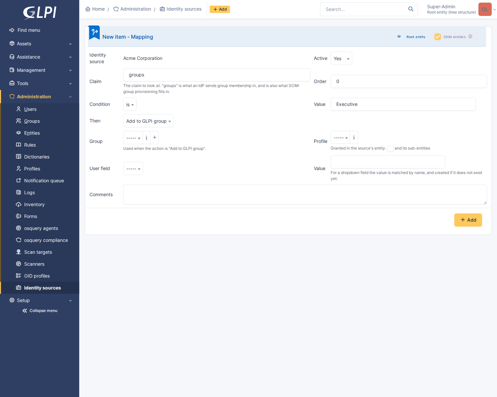

# Mapping

A mapping turns something a customer's directory says into something GLPI does.
They live on the **Mappings** tab of an identity source, and they are the reason
`Executive` can mean `VIP`.

```
groups is "Executive"        → add to GLPI group "VIP"
groups is "IT Staff"         → grant profile "Technician"
groups contains "-admins"    → grant profile "Admin", recursively
department is "Field Svc"    → set Location to "Depot"
```



---

## How rules are read

**Every rule that matches applies.** This is not a first-match-wins list.
Somebody in both `Executive` and `IT Staff` gets the VIP group *and* the
Technician profile, which is what an administrator means when they write both
rules. A list that stopped at the first match would silently drop the second.

The order field only decides the order things are applied in, which matters for
exactly one case: two `Set user field` rules writing the same field, where the
last one wins.

**Rules belong to a source.** GLPI has a global authorisation-rules engine and
this deliberately does not use it. For an MSP that engine is the wrong shape:
forty customers' rules in one ordered list, where the isolation between them
depends on every rule remembering to test which directory it came from. Here a
rule cannot see a claim from a directory it does not belong to, because it is
never asked about one.

---

## What a rule can do

### Add to a GLPI group

The common case. The group is picked from GLPI's own groups; the rule does not
create one.

### Grant a GLPI profile

Granted **in the source's entity**, optionally recursive into sub-entities. The
entity is not something a rule can choose — a rule that could choose it would be
a way for one customer's directory to place a user in another customer's tree.

If two matching rules grant the same profile and either is recursive, the grant
is recursive. That is an OR rather than "last rule wins", so the outcome does
not depend on rule order in a way nobody would predict from reading the list.

### Set a user field

An allowlist, and a short one:

| Field | Type |
|---|---|
| Location | dropdown |
| Title | dropdown |
| Category | dropdown |
| Administrative number | text |
| Phone, Phone 2, Mobile | text |
| Comments | text |

Dropdown values are matched by name and created if absent, which is the GLPI
idiom and what an administrator writing "London Office" expects.

The allowlist is the point. The interesting fields on a GLPI user are
`authtype`, `password`, `is_active` and `profiles_id`, and a mapping engine that
could reach any column would be a way for a directory to disable an
administrator or change how they authenticate. Everything here is descriptive:
worst case a rule writes a wrong phone number.

---

## Operators

| Operator | Matches when |
|---|---|
| **is** | the value equals the rule's value, ignoring case |
| **contains** | the value contains it anywhere |
| **starts with** | the value begins with it |
| **matches regex** | the value matches the pattern |

Equality ignores case because directory group names are compared by people
typing them into a form, and `executive` not matching `Executive` is a support
ticket rather than a security property.

Regular expressions are written without delimiters — `^acme-.*-admins$`, not
`/^…$/`. That stops a stray delimiter from accidentally enabling a modifier, and
an invalid pattern is refused when the rule is saved rather than failing quietly
at sign-in.

A rule with an empty value never matches. A rule with no target — no group, no
profile, no field — is refused on save, because a rule that silently does
nothing is worse than an error: it looks configured.

---

## Where the values come from

A rule names a **claim**. Two things fill claims in, and a rule does not care
which:

**The id token, at sign-in.** Whatever the provider put in it —
`groups`, `department`, `jobTitle`, anything. The claim names the source reads
for identity (username, email, names, groups) are configured on the source; a
mapping can name any claim at all.

**Directory groups, from SCIM.** When the groups claim is absent, the groups
that SCIM's `/Groups` endpoint has recorded for this person stand in. This is
what makes group mapping work for a provider whose token carries no groups, and
it is why SCIM group membership re-applies mappings immediately rather than
waiting for the next sign-in.

Claim values are normalised before matching: a scalar becomes a one-item list, a
list stays a list, and objects are reduced to their `display`, `name` or `value`
— preferring the human-readable one, because that is what an administrator will
have typed into the rule.

---

## When a provider sends GUIDs

Entra ID's groups claim contains group object IDs, not names. A rule matching
`Executive` will never fire.

The good fix is SCIM provisioning: group display names arrive that way, are
recorded as directory groups, and rules match on names. The mapping form lists
the directory groups this source has actually sent, so you pick from a list.

Without SCIM, write rules against the GUID with operator *is*, and put the human
name in the rule's comment — nothing else will tell you what it is six months
later.

---

## What the plugin will and will not take away

Assignments this plugin makes are marked **dynamic**, and are recomputed from
scratch on every sign-in and every SCIM change: added, removed, or left,
according to what the directory says today.

Assignments an administrator made by hand are **never touched**. Not on sign-in,
not on deprovisioning, not ever.

Without that split, one of two bad things is true: either the plugin can never
withdraw a profile it granted — so somebody who leaves `IT Staff` keeps
Technician for ever — or it withdraws one that somebody deliberately granted by
hand.

This is why removing a person from a directory group takes their mapped GLPI
group away, and why granting a profile manually survives the next sign-in.

---

## The default profile

Set on the source, under Placement. It is granted to anyone no mapping gives a
profile to.

It is worth setting even when you have profile mappings. Somebody who
authenticates and then has no profile in any entity gets a GLPI that refuses
every page, which reads as a broken login rather than as a missing mapping — and
the sign-in is refused with exactly that explanation in the event log.

---

## Mirroring

**Mirror unmapped groups** — off by default — creates a GLPI group of the same
name in the source's entity for every directory group that no mapping covers.

Leave it off unless you have a reason. One shared group tree filling up with a
dozen organisations' internal vocabulary — three "All Staff" groups, four
"Everyone" — helps nobody, and the mapping is the supported way to decide which
of a directory's groups deserves to exist in GLPI.

---

## Checking a mapping

The event log records every decision: which rules matched, and what changed as a
result. **Setup → Plugins → GLPI Identity** shows recent events; the detail for
a `mapped` event is the list of rules that fired followed by the list of changes
they caused.

If a rule is not firing, in order of likelihood:

1. The claim carries GUIDs or paths rather than names — see above.
2. The claim name is wrong. Okta and Keycloak need a claim *configured*; it is
   not there by default.
3. The rule is inactive.
4. The value has a typo — the mapping form lists the group names this directory
   has actually sent, which is the fastest way to see it.
5. Keycloak's "Full group path" is on, so the claim contains `/parent/child`
   and a rule matching `child` does not fire. Either turn it off or use
   *contains*.
