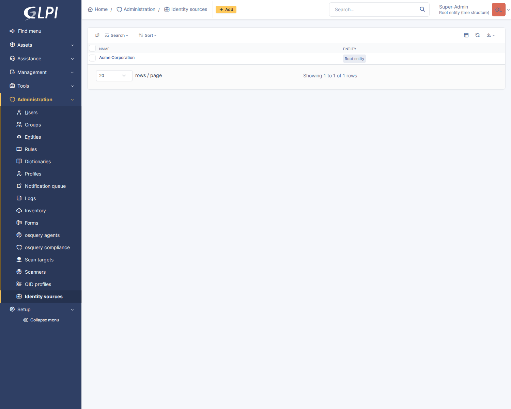

# Connecting a customer's directory

One identity source per customer. Create it first — Administration → Identity
sources → Add — set the name and entity, save, and then work through whichever
provider they use.

Two URLs come from the source's form and go into the provider's console:

| | |
|---|---|
| **Redirect URI** | `https://your-glpi.example.com/plugins/glpiidentity/front/sso.php/callback` |
| **SCIM endpoint** | `https://your-glpi.example.com/plugins/glpiidentity/front/scim.php/v2` |

The redirect URI is the same for every source — providers compare it character
for character, so copy it from the form rather than typing it. The SCIM endpoint
is the same too; what distinguishes one customer from another is the bearer
token, which is why the token is the thing that must not be shared.

Both are built from GLPI's configured **URL of the application**
(Setup → General). If that is wrong, sign-in fails with a redirect-URI mismatch
and there is no clue on this end.

---

## Before any provider: the group-name problem

The single most common surprise, so it is worth understanding once rather than
per-provider.

A mapping rule matches on what the directory *says* a group is called. Providers
disagree about what that means:

| Provider | What the id token's groups claim contains |
|---|---|
| Okta | Group **names**, if you configure the claim |
| Keycloak | Group **names** or paths, via a group-membership mapper |
| Entra ID | Group **object IDs** (GUIDs), by default |
| Google Workspace | Nothing — there is no groups claim |

So for Okta and Keycloak, sign-in alone is enough for group mapping. For Entra
you either write rules against GUIDs — which works and is horrible to read — or
turn on SCIM provisioning, which sends group *display names* and records them as
directory groups that a rule can match by name. For Google, SCIM or nothing.

The mapping form lists the directory groups this source has actually sent, so
once provisioning has run once you pick from a list rather than guessing.

---

## Microsoft Entra ID

### Sign-in

1. **Entra admin centre → App registrations → New registration.**
   - Redirect URI: platform **Web**, and the callback URL above.
2. **Certificates & secrets → New client secret.** Copy the *Value*, not the
   Secret ID.
3. **Overview** gives the Application (client) ID and the Directory (tenant) ID.

In GLPI, on the source:

| Field | Value |
|---|---|
| Issuer | `https://login.microsoftonline.com/<tenant-id>/v2.0` |
| Client ID | the Application (client) ID |
| Client secret | the secret *Value* |
| Email domains | the customer's verified domains |
| Scopes | `openid profile email` (the default) |

Save, then press **Refresh metadata**.

The default claim names are already right for Entra: `preferred_username`,
`email`, `given_name`, `family_name`.

### Groups in the token

**Token configuration → Add groups claim.** Choose Security groups, and under
the ID token options select **Group ID** — the only choice for cloud-only
groups. The claim then contains GUIDs, and a rule matching `Executive` will
never fire.

Two ways forward:

- **Preferred:** turn on SCIM provisioning below. Group display names arrive
  that way and rules match on names.
- Otherwise, copy each group's Object ID from Entra and write rules with
  operator *is* against the GUID. Put the human name in the rule's comment,
  because nothing else will tell you what it is.

Entra also stops sending the claim entirely once a user is in more than about
150 groups, sending an "overage" indicator instead. This plugin asks the
userinfo endpoint when the claim is missing, which covers some cases — but a
customer with large group counts should use SCIM.

### Provisioning

1. **Enterprise applications → your app → Provisioning → Get started.**
2. Mode: **Automatic**.
3. Tenant URL: the SCIM endpoint above.
4. Secret Token: press **Generate a token** on the GLPI source and paste it.
   It is shown once.
5. **Test Connection** — Entra fetches `ServiceProviderConfig` and tries a
   filtered user lookup. Both are implemented; a failure here is nearly always
   the URL or the token.
6. Under **Mappings**, `Provision Azure Active Directory Users` and
   `…Groups` can both stay on. In the user mapping, the attributes this server
   uses are `userName`, `externalId`, `active`, `name.givenName`,
   `name.familyName` and `emails`. Anything else is accepted and ignored.
7. Assign users and groups to the application — Entra only provisions what is
   assigned — and set Provisioning Status to On.

Entra's first cycle can take up to 40 minutes. Subsequent ones are ~40 minutes
apart; "Provision on demand" is faster for testing.

---

## Okta

### Sign-in

1. **Applications → Create App Integration → OIDC → Web Application.**
2. Sign-in redirect URI: the callback URL above.
3. Assign it to the people who should be able to sign in.

In GLPI:

| Field | Value |
|---|---|
| Issuer | `https://<org>.okta.com` — or `https://<org>.okta.com/oauth2/default` if you use the default authorisation server |
| Client ID / secret | from the app's General tab |
| Email domains | the customer's domains |

The issuer must match what Okta puts in the `iss` claim exactly. If sign-in
fails with a token that "came from a different issuer", it is almost always the
`/oauth2/default` suffix being present on one side and not the other.

### Groups in the token

**Security → API → Authorization Servers → your server → Claims → Add Claim.**

- Name: `groups`
- Include in: **ID Token**, Always
- Value type: **Groups**
- Filter: `Matches regex` `.*` — or something narrower, which is better
  practice: a customer with three hundred groups sends all of them on every
  sign-in otherwise.

Okta sends group names, so rules can be written against them directly.

### Provisioning

Okta's generic **SCIM 2.0 Test App (OAuth Bearer Token)** integration, or a
custom app with provisioning enabled:

- SCIM connector base URL: the SCIM endpoint above
- Unique identifier field for users: `userName`
- Supported provisioning actions: Push New Users, Push Profile Updates, Push
  Groups, and Deactivate Users
- Authentication Mode: HTTP Header, with the generated token

Push Groups is worth enabling even when the groups claim already works: it gives
the mapping form a list of the customer's real group names.

---

## Google Workspace

Sign-in works; **provisioning does not**. Google does not push SCIM to arbitrary
endpoints — its automated provisioning is limited to applications in its own
catalogue — so there is no way to point it at this one.

That has a consequence worth being explicit about: **group mapping is not
available for Google Workspace through this plugin**, because Google sends no
groups claim either. Users sign in and get the source's default profile;
anything beyond that is assigned by hand, or the customer uses a directory that
can provision.

### Sign-in

1. **Google Cloud console → APIs & Services → Credentials → Create Credentials
   → OAuth client ID → Web application.**
2. Authorised redirect URI: the callback URL above.
3. Configure the OAuth consent screen as **Internal** for a Workspace domain.

In GLPI:

| Field | Value |
|---|---|
| Issuer | `https://accounts.google.com` |
| Client ID / secret | from the credential |
| Username claim | `email` — Google sends no `preferred_username` |
| Email domains | the customer's domains |

---

## Keycloak

### Sign-in

1. **Clients → Create client** → OpenID Connect, client authentication **On**.
2. Valid redirect URIs: the callback URL above.
3. **Credentials** tab for the secret.

In GLPI:

| Field | Value |
|---|---|
| Issuer | `https://keycloak.example.com/realms/<realm>` |
| Client ID / secret | from the client |

### Groups in the token

**Client scopes → `<client>-dedicated` → Add mapper → By configuration → Group
Membership.**

- Token Claim Name: `groups`
- Full group path: **Off** — on, the claim contains `/parent/child` and a rule
  matching `child` will not fire
- Add to ID token: On

---

## Other providers

Anything that speaks OpenID Connect discovery will work: JumpCloud, Auth0,
Authentik, Ping. The two things to get right are always the same — the issuer
must match the `iss` claim exactly, and the groups claim must contain names you
are willing to write rules against.

For SCIM, anything that can push to a bearer-token endpoint will work.
JumpCloud and Authentik both can.

---

## When it does not work

Every refusal is recorded with its reason. **Setup → Plugins → GLPI Identity**
shows the recent events; the detail column carries the provider's own words,
which is usually the whole answer.

| Symptom | Almost always |
|---|---|
| "We could not find a single sign-on provider for that address" | The domain is not on any source, or the source is not `sso_enabled`, or metadata has never been refreshed |
| Redirect-URI mismatch, at the provider | GLPI's **URL of the application** does not match the URL people actually use |
| "The identity token came from a different issuer" | The issuer in GLPI has a trailing path the provider does not use, or vice versa — Okta's `/oauth2/default` is the usual culprit |
| "The identity token was issued for a different application" | The client id on the source belongs to a different app registration |
| "That sign-in took too long" | More than ten minutes on the provider's page — or a reverse proxy stripping cookies on the callback |
| A sign-in that works and then bounces straight back out | The account has no profile in any entity: set a **default profile** on the source. This plugin refuses such a sign-in with that reason rather than letting it half-succeed |
| "Your session could not be validated", fixed only by clearing cookies | A session poisoned by GLPI's EXTERNAL auth mode, usually left by another SSO plugin. Signing in through this plugin clears it — see the README |
| SCIM Test Connection fails | The token, or the URL — try `curl -H "Authorization: Bearer <token>" <endpoint>/ServiceProviderConfig` |
| SCIM works but nobody appears | The provider is only provisioning what is assigned to the application |
| Nothing appears on the login page | The source is not *ready*: it needs to be active, SSO-enabled, with a client id, a secret, and metadata that has been refreshed at least once |
| You want a one-click button for your own staff | Fill in **Button label** on the house source. Empty — the default — means the email box alone, which already routes them |
| You want single sign-on only | Turn off **Keep the username and password form**. `index.php?local=1` still reaches it, and it reverts automatically if no provider is working |
| Locked out with no working provider | The password form comes back on its own in that case. Failing that, `index.php?local=1` |
| A user is provisioned but has no rights | No mapping matched and no default profile is set |
| A mapping never fires | The claim carries GUIDs, not names — see the group-name problem above |
